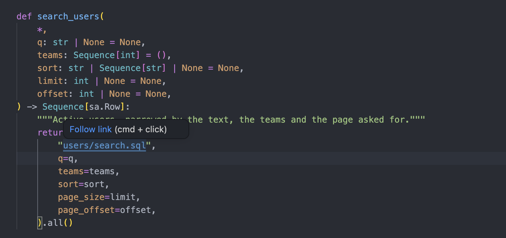
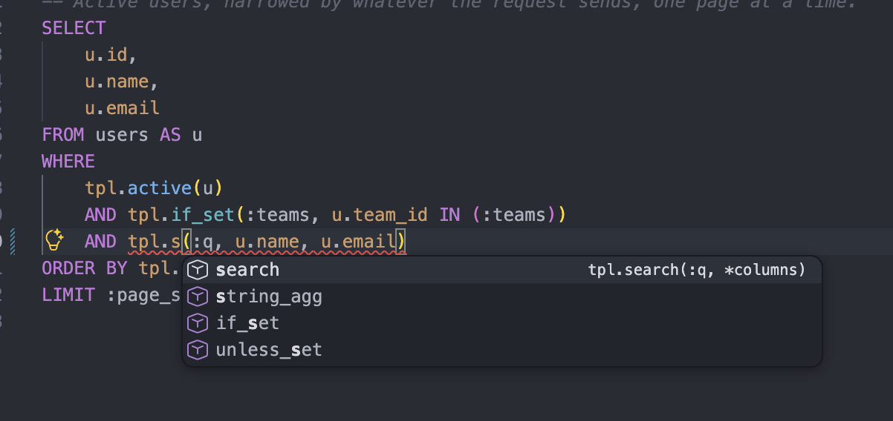
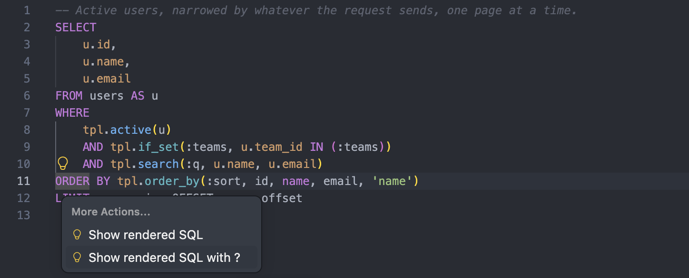
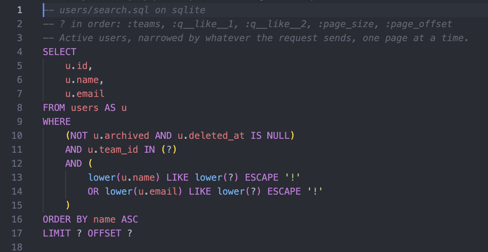

# SQL templates

Some queries are easier to write as plain SQL: a report with window functions,
a bulk update with `FROM`, a recursive CTE. Pushing them through the query
builder only makes them longer.

This layer lets you keep that SQL in files, binds the values for you, and
returns rows through the same methods a query has.

A template is SQL with `:name` parameters. Whatever changes from call to call,
an optional condition or a sort order, is a call such as `tpl.if_set(...)`,
which `SQLAKit` expands before the query runs:

```sql
SELECT id, name
FROM users
WHERE team IN (:teams)
  AND tpl.if_set(:search, tpl.icontains(name, :search))
ORDER BY tpl.order_by(:sort, id, name)
```

Values are bound, so they never reach the SQL text itself.

### Why this syntax?

The syntax keeps a template valid SQL. `tpl.if_set(...)` is a call of a
function in a schema named `tpl`, and `:teams` is a parameter, both written the
way SQL writes them. So every tool that reads SQL reads a template as it is,
with no context and no plugin:

- a formatter or a linter, such as `sqruff` or `sqlfluff`
- the SQL support of an editor, and PyCharm or DataGrip
- a database console, once the parameters have values

A template language such as `Jinja` puts `` and `{{ x }}` between the
SQL, so a tool that reads SQL sees a file it can't parse. Here the logic goes
into macros, functions you call, instead of statements between the lines.

## Template directories

Set the template directory with `templates=` when you create the database:

```python
from pathlib import Path

from sqlakit import Database

BASE_DIR = Path(__file__).parent / "sql"

db = Database("postgresql+psycopg://localhost/app", templates=BASE_DIR)
```

If you use the registry, pass the same argument to `configure()`:

```python
from pathlib import Path

from sqlakit import db

BASE_DIR = Path(__file__).parent / "sql"

db.configure(
    "postgresql+psycopg://localhost/app",
    templates=BASE_DIR,
)
```

The rest of this page uses the first form, and everything works the same with
the second.

You address a template by its path from that root, extension included:
`db.sql("reports/by_team.sql")` reads `BASE_DIR/reports/by_team.sql`. You can
keep templates next to the code that uses them, or collect them all in one
directory.

Three calls take SQL, one per source of it, and all three read rows the same
way:

| call | the source of the SQL |
| --- | --- |
| `db.sql(name)` or `db.sql.from_file(name)` | a template under `templates=` |
| `db.sql.from_string(source)` | a string in the code, rendered the same way |
| `db.sql.from_statement(statement)` | a finished `SQLAlchemy` statement, unrendered |

`db.sql(name)` is a shorthand for `from_file`, and the one you'll use most of
the time. The other two are covered below.

For anything beyond the directory, pass a `Templates` object:

```python
from sqlakit.sql import Templates

db = Database(
    DB_URL,
    templates=Templates(BASE_DIR, auto_reload=DEBUG, macros=["app.sql.macros"]),
)
```

`auto_reload` reads a template again when it changes, for a development server.
A file of macros is read once, so restart the server after changing one.
`macros` adds [macros of your own](#macros-of-your-own). `namespace` renames
`tpl`, for a database that has a real schema of that name:
`Templates(BASE_DIR, namespace="q")` reads `q.if_set(...)`.

## Row reads

```python
rows = db.sql("reports/by_team.sql", since=since).all()
```

Keyword arguments are the template's values. You can also pass them as a
dict, and a keyword argument next to it overrides the value of the same name:

```python
rows = db.sql("reports/by_team.sql", filters).all()
rows = db.sql("reports/by_team.sql", filters, since=since).all()
rows = db.sql("reports/by_team.sql", context=filters).all()
```

`SQLAKit` doesn't change the dict, and a key named `context` is a value like
any other. Rows come back as `SQLAlchemy` `Row` objects, which you can read by
name or by position.

If you'd rather get rows as a type of your own, call `typed`:

```python
class TeamReport(BaseModel):
    team: str
    members: int


teams = db.sql("reports/by_team.sql", since=since).typed(TeamReport).all()
```

Pass the type of **one row**. The container depends on the method that runs
the query: `all()` returns a list and `one()` a single row. Rows are
validated by `pydantic`, which means a `pydantic` model, a dataclass, a
`TypedDict` and a plain `int` all work, and a row of the wrong shape raises
`ValidationError` right away instead of somewhere downstream.

Keyword arguments go to `validate_python`, so a validator that reads a
`context` gets one, and `strict`, `by_alias` and the rest of pydantic's
arguments work too:

```python
teams = (
    db.sql("reports/by_team.sql", since=since)
    .typed(TeamReport, context={"tenant": tenant})
    .all()
)
```

The same arguments reach every row the query reads, a batch of `chunks`
included.

Reading a template takes three calls, each with its own arguments:

| call | its arguments |
| --- | --- |
| `db.sql(name, values)` | the template, and the values it renders with |
| `.typed(Type, ...)` | pydantic's: the type of a row, and how to validate it |
| `.all()`, `.one()`, `.first()`, `.chunks(n)` | how many rows you want |

Keeping them apart means `context` can't mean two things: the template's
values go in the first call, pydantic's validation context in the second. A
query on a model skips the second call, since there's nothing to validate:
`db.query(User).all()`.

With `typed(int)`, a one-column row comes back as the value of that column:

```python
total = db.sql("reports/total.sql").typed(int).one()
```

`scalars` reads the first column of the result, and you don't have to declare
a type:

```python
total = db.sql("reports/total.sql").scalars().one()
names = db.sql("users/names.sql").scalars().all()
```

Call `typed` or `scalars`, not both.

The methods that run the query are the same ones a query has: `all`, `first`,
`one`, `one_or_none`. They raise `SQLAlchemy`'s own `NoResultFound` and
`MultipleResultsFound`, the same way an ordinary result does. A query on a
model raises `InstanceNotFoundError` instead, with the model's name in the
message.

## Rows as models

When the SQL selects a model's columns, `from_sql` maps them onto it:

```python
users = User.query.from_sql("users/active.sql", team="red").all()
users = db.query(User).from_sql("users/active.sql", team="red").all()
```

Both lines do the same thing. The second one works without the
[model layer](models.md). The examples below use the shorter `User.query`
form.

The rows come back as instances, in the session. You can't add conditions to
such a query in Python, since the SQL already sets what it selects. A `where`
on top of it raises `RawStatementError`, and the message suggests moving the
condition into the SQL.

`from_sql` works with a file, which is the common case. For everything else
there's `from_statement`, which accepts both what the calls above return and
a statement built with `SQLAlchemy`:

```python
User.query.from_statement(db.sql.from_string("SELECT * FROM users LIMIT 10"))
User.query.from_statement(
    sa.text("SELECT * FROM users WHERE id = :id").bindparams(id=1)
)
```

One caveat: `SQLAKit` does not apply a model's
[`__query_filter__`](queries.md#soft-deletes) to your statement. If
you rely on that hook to hide soft-deleted rows or another tenant's rows,
repeat the condition in the template's own `WHERE`.

## Row writes

```python
with db.transaction():
    archived = db.sql("users/archive_inactive.sql", before=cutoff).execute()

log.info("archived %d users", archived)
```

`execute()` runs a writing template and returns the number of affected rows.
Use it for `INSERT`, `UPDATE` and `DELETE`. Inside a transaction the write
commits or rolls back with the rest of it. In a block with no transaction the
call commits on its own, as ORM writes do.

## Table iteration

```python
with db.transaction():
    for batch in db.sql("exports/contacts.sql").chunks(1000):
        write(batch)
```

This is one query read in batches. The database keeps a cursor open for the
whole walk, so don't leave the transaction until you're done. If you'd rather
commit each batch separately, page the table with
[`cursor_page`](queries.md#walking-a-whole-table).

## Inline SQL

A three-line query doesn't need a file of its own. `from_string` reads the
same syntax, and the source stays right in your code:

```python
query = db.sql.from_string("SELECT id FROM users WHERE team = :team", team="red")
ids = query.scalars().all()
```

This is the only call that works without `templates=`, and it can't
`tpl.include` a file without it. Grep for it when you want to find every place
that builds SQL from strings.

A `:name` the call passes no value for raises `StrayParameterError` before the
query runs, naming the parameter. A driver's `?` or `%s` binds nothing here:
`from_string` has no positional arguments to fill one with.

`from_statement` takes SQL that `SQLAlchemy` built, and reads it the same way:

```python
statement = sa.text("SELECT * FROM users WHERE id = :user_id").bindparams(user_id=1)

user = db.sql.from_statement(statement).typed(User).one()
totals = db.sql.from_statement(sa.select(Sale.team, sa.func.sum(Sale.amount))).all()
```

`SQLAKit` renders nothing here: the parameters belong to the statement,
written in the regular `SQLAlchemy` syntax. The call adds the reading methods
(`typed`, `scalars`, `chunks` and the rest) on top of a statement you built
anywhere.

## Template syntax

`SQLAKit` binds every value as a parameter, whatever its type:

```sql
SELECT * FROM users WHERE team = :team AND joined_at > :since
```

Put a list in brackets, as SQL writes one, and `SQLAKit` binds it as one
parameter, whatever its length. An empty list matches nothing and doesn't
break the query:

```sql
SELECT * FROM users WHERE id IN (:ids)
```

A `LIMIT` or an `OFFSET` the call passes no value for takes every row and skips
none, on every database:

```sql
SELECT * FROM users ORDER BY id LIMIT :limit OFFSET :offset
```

A dotted name reads an attribute of the value, or a key of a dict, so you can
pass the object you have instead of taking it apart:

```python
rows = db.sql("users/search.sql", criteria=criteria, status=Status).all()
```

```sql
SELECT * FROM users WHERE team IN (:criteria.teams) AND status = :status.OPEN.value
```

A name that reads nothing raises `ParameterPathError`, naming the step that
failed.

A cast can follow a parameter, `:id::uuid` on PostgreSQL. A colon that is part
of the SQL itself, in a JSON literal, is written `\:`: `'{"a"\:1}'`. An
unescaped one raises `StrayParameterError` before the query runs, with the file
name in the message. A class in a regular expression, `[[:punct:]]`, needs no
escaping.

Some values need a type the driver can't guess on its own: NULL, a JSON
document, an array. Pass `sa.bindparam`, and the value goes through with its
type:

```python
db.sql("events/at.sql", at=sa.bindparam("at", when, type_=sa.DateTime(timezone=True)))
```

## Values written into the SQL

Some places in SQL take no bound value, only something written into the
statement: a stage in `COPY INTO`, a table being created or renamed, a sample's
size. Pass an `Inline` value, and the template names it like any parameter:

```python
from sqlakit.sql import Inline

db.sql(
    "exports/orders.sql",
    location=Inline.stage("exports", f"orders/{day}/"),
    since=since,
).execute()
```

```sql
-- Snowflake
COPY INTO :location
FROM (SELECT * FROM orders WHERE placed_at >= :since)
FILE_FORMAT = (TYPE = CSV)
```

`:location` is written as `@exports/orders/2026-09-25/`, and `:since` is bound
as usual. A linter reads `:location` as a parameter, so the template stays SQL
to it.

Writing a value into SQL is how injection happens, so `SQLAKit` is strict
about it:

- `Inline.stage(name, path)` takes a stage name, and a path of letters,
  digits, `_`, `.`, `-` and `=`, with no `..`. `Inline.name(value, *allowed)`
  takes one of the names listed, or a plain one without a list.
  `Inline(text)` writes anything, so keep it to code that checked the text.
- The value is written only after `INTO`, `FROM`, `JOIN`, `LIST`,
  `PUT <file>`, `TABLE`, `VIEW`, `STAGE`, `TO`, `SCHEMA`, `DATABASE`, `USE`,
  and inside `SAMPLE (...)`. Anywhere else, such as `WHERE x = :v`, it raises
  `InlineValueError`, since a bound value does the same there without the risk.

## Macros

A call in the `tpl` schema writes the SQL that depends on the call's values or
on the database. These are built in, and `sqlakit macros` lists them with their
docstrings. `sqlakit macros app.sql.macros` adds the macros of a module, and
`--markdown` prints the list as Markdown for your own docs:

| macro | writes |
| --- | --- |
| `tpl.if_set(:x, expr[, otherwise])` | `expr` when `:x` holds a value, `otherwise` (`TRUE`) when it doesn't |
| `tpl.unless_set(:x, expr[, otherwise])` | `expr` when `:x` holds no value |
| `tpl.in_list(col, :values, :exclude)` | `col IN (:values)`, or `NOT IN` when `:exclude` is set, and `TRUE` when the list is empty |
| `tpl.between(col, :from, :to[, '[)'])` | a range whose ends may each be missing |
| `tpl.order_by(:sort, col, ...)` | the terms of an `ORDER BY` from sort strings, only by the columns listed |
| `tpl.icontains(col, text)` | a search for the text without regard to case |
| `tpl.icollate(col)` | the column compared and sorted without regard to case |
| `tpl.identifier(:name, col, ...)` | a name from a parameter, quoted, only one of those listed |
| `tpl.each(:list)` | one parameter per value, for a list outside `IN` |
| `tpl.array(:list[, 'text'])` | an array, cast to the type on PostgreSQL |
| `tpl.arrays_overlap(a, b)`, `tpl.array_contains_all(a, b)` | `&&` and `@>` on PostgreSQL, their Snowflake functions |
| `tpl.values(:rows)` | a small table written out in the query |
| `tpl.json_object(...)`, `tpl.array_agg(...)`, `tpl.string_agg(...)`, `tpl.array_contains(...)` | the function each database spells its own way |
| `tpl.on_dialect(postgresql = a, snowflake = b)` | the branch of the database in hand |
| `tpl.include('path.sql')` | the query of another template, in parentheses |

A value is missing when it is `None`, `False` or empty. `0` is a value.
`if_set`, `unless_set`, `array`, `order_by`, `between` and `in_list` also
treat a parameter the call didn't pass as missing. Any other macro raises
`MacroArgumentError` for it. That covers the optional parts of a query:

```sql
SELECT * FROM users
WHERE tpl.if_set(:teams, team IN (:teams))
  AND tpl.between(joined_at, :since, :until, '[)')
  AND tpl.unless_set(:include_archived, NOT archived)
```

A sort string is `name`, `name.desc` or `name.desc.nulls_last`, in any case
convention, and a request can send a list of them. `order_by` sorts only by the
columns listed after the parameter, so a name from a request never goes into
the SQL as it is. After the columns:

- `name = <expression>` sorts by an expression under that name
- `'nulls_last'` puts the nulls last for every term that doesn't say otherwise
- any other string in quotes is the sort when the call passes none


```sql
SELECT * FROM users
ORDER BY tpl.order_by(:sort, id, created_at, name = tpl.icollate(name), 'created_at.desc', 'nulls_last')
```

`tpl.icollate(name)` is `lower(name)` on PostgreSQL. In a query with
`GROUP BY name`, sorting by it no longer matches the grouped column, so group
by the same expression.

`if_set` and `unless_set` expand only the branch they write. A macro
in the other one never runs, so it can't fail on a value that wasn't meant for
it. A branch of `if_set` or `unless_set` that joins conditions with `AND` or
`OR` goes in brackets, so `tpl.if_set(:x, a OR b, FALSE) AND c` stays
`(a OR b) AND c`. Any other branch goes in as written, a column or a sort term
included.

Where databases spell something differently, a macro writes the right form
for each: `icontains` is `ILIKE` on PostgreSQL and `CONTAINS(COLLATE(...))` on
Snowflake. `on_dialect` covers what no macro does, such as a table that lives
elsewhere on one database.

`tpl.include` puts the query of another file where a table goes, and adds
brackets unless the call already stands in some. Both templates use the same
parameters:

```sql
WITH found AS (SELECT * FROM tpl.include('users/search.sql') AS s)
SELECT count(*) FROM found
```

## Macros of your own

A macro is a function that returns SQL. Decorate it with `sql_macro` and
annotate what each argument is:

```python
from sqlakit.sql import Param, Sql, sql_macro, tpl


@sql_macro
def owned_by(team_ids: Param, user_ids: Param) -> str:
    """Rows of any of the teams or users, and none when neither is given."""
    criteria = [
        f"{column} IN {param}"
        for column, param in (("team_id", team_ids), ("user_id", user_ids))
        if param.value
    ]
    return f"({' OR '.join(criteria)})" if criteria else "FALSE"


@sql_macro
def search(q: Param, *columns: Sql) -> str:
    """Rows where any of the columns holds the text, regardless of case."""
    if not q.value:
        return "TRUE"
    return " OR ".join(tpl.icontains(column, q) for column in columns)
```

```sql
SELECT * FROM documents WHERE tpl.owned_by(:teams, :users) AND tpl.search(:q, title, body)
```

A `Param` argument is written `:name` in the template, and carries `.value`.
Its string is the placeholder, so the parameter goes back into the SQL and is
bound. A `Sql` argument is the text written there, with the macros inside it
already expanded. A first argument annotated `Context` brings `ctx.dialect`,
and `ctx.bind(value, "name")` for a value the macro binds itself. A
`Literal["'a'", "'b'"]` annotation limits an argument to that SQL.

Register the macros with the templates, as objects or by the module they live
in:

```python
Templates(BASE_DIR, macros=[owned_by, search])
Templates(BASE_DIR, macros=["app.sql.macros"])
```

A macro calls another as a template does, through `tpl`. It passes a `Sql` it
was given, or what another macro returned, where SQL goes, and a `Param` or a
plain value where a parameter goes. A plain `str` where SQL goes raises
`MacroArgumentError`, since it could be a value from a request written into the
SQL. Wrap SQL of your own in `Sql("...")`:

```python
from sqlakit.sql import Param, Sql, sql_macro, tpl


@sql_macro
def named(q: Param) -> str:
    """Rows whose name holds the text, regardless of case."""
    return tpl.icontains(Sql("name"), q)
```

`sql_macro` takes three options:

| option | effect |
| --- | --- |
| `name="..."` | the name templates call, in place of the function's |
| `optional=True` | a parameter the call didn't pass reads as `None`, the way `if_set` does |
| `lazy=True` | a `Sql` argument expands only when the macro turns it into a string, so a macro that picks one branch never expands the others |

## Macros written in SQL

A macro that is a piece of SQL needs no Python. Write it in a `.sql` file as a
`SELECT` of the expression: the alias is the macro's name, and `FROM` lists
its arguments. A comment right above is its description, and several share a
file:

```sql
-- app/sql/_macros.sql

-- Rows of the tenant, and of one team when asked.
SELECT t.tenant_id = :tenant_id AND tpl.if_set(:team_id, t.team_id = :team_id)
    AS for_tenant
FROM t;

-- Rows that are neither archived nor deleted.
SELECT NOT t.archived AND t.deleted_at IS NULL AS active FROM t;
```

```sql
SELECT * FROM orders AS o WHERE tpl.for_tenant(o) AND tpl.active(o)
```

A call writes the expression in its place, in brackets, when the template is
read, with each argument's text where the expression names it:
`tpl.for_tenant(o)` writes `(o.tenant_id = ...)`. Parameters are the calling
template's own, and the macros in the expression expand as they would in the
template.

Name the file so that it ends in `macros.sql`, such as `_macros.sql` or
`tenant.macros.sql`, and put it in a template directory. `SQLAKit` finds it
there, so you don't register it. It isn't a template, so `db.sql(...)` won't
read it. A file elsewhere goes in `macros=` by its path, next to the rest:

```python
Templates(BASE_DIR, macros=["app.sql.macros", SHARED_DIR / "tenant.sql"])
```

The file is SQL a linter reads like a template, with each argument declared as
a table, so it checks the references in the expression too. `check()` and
`sqlakit check` read it as well: an unknown macro in a body is reported on its
line in the file.

## Macros with their SQL in a file

When a macro's SQL needs values worked out in Python, keep the SQL in a file
and let the function return the values:

```python
from typing import Any

from sqlakit.sql import Param, Sql, sql_macro


@sql_macro("tenant.sql")
def for_tenant(t: Sql, tenant: Param) -> dict[str, Any]:
    """Rows of the tenant, and of its teams."""
    return {"tenant_id": tenant.value.id, "teams": tenant.value.team_ids}
```

```sql
-- tenant.sql, next to the module
SELECT t.tenant_id = :tenant_id AND tpl.if_set(:teams, t.team IN (:teams))
    AS for_tenant
FROM t;
```

The file is written like a file of SQL macros, and the function's name picks
the statement in it. Each table after `FROM` is the function's argument of the
same name. Each `:name` in the file belongs to the macro: the function returns
its value, and `SQLAKit` binds it under a name of its own, so it never clashes
with another call or with the template's parameters. If the SQL reads a value
the function doesn't return, or the function returns one the SQL doesn't read,
the call raises `MacroArgumentError`.

The path is from the module's directory. The macro is registered as any Python
macro is, and the file isn't a template.

## SQL inspection

`statement` gives you the finished SQL, rendered and bound, without running
anything. You can check it in a test, or feed it to `EXPLAIN`:

```python
statement = db.sql("reports/by_team.sql", since=since).statement
```

`SQLAKit` adds the template name to the SQL as a comment, so a slow query log,
a [recording](debugging.md) and `pg_stat_statements` all show the source file
of each query:

```sql
/* reports/by_team.sql */
SELECT team, count(*) AS members
FROM users
WHERE joined_at > :since
GROUP BY team
```

## Linters

A template is SQL, so `sqruff` or `sqlfluff` reads it with the `placeholder`
templater, which writes each `:name` as `name`: `:status` reads as a column.
A parameter named like a keyword doesn't, since `LIMIT :limit` reads
`LIMIT limit`, and needs a value. `sqlakit export sqruff` or
`sqlakit export sqlfluff` writes the settings into `pyproject.toml`, with a
value for each such parameter of your templates:

```console
$ sqlakit export sqruff --dialect snowflake
wrote pyproject.toml
$ sqruff lint app/sql
```

```console
$ sqlakit export sqlfluff --dialect snowflake
wrote pyproject.toml
$ sqlfluff lint app/sql
```

The two read a template the same way, and with the same rules `fix` writes the
same SQL. `sqruff` is written in Rust and runs faster. `sqlfluff` is the one
more projects already use.

`export` asks the installed linter which words its dialect reserves, because
they differ from SQLAlchemy's: `exclude` and `row` are reserved in SQLite. Run
it again when a template gains a parameter named like a keyword.
`sqlakit export sqruff --check` fails in CI when it's out of date, and so does
`sqlakit export sqlfluff --check`. It writes `[tool.sqruff.core]` or
`[tool.sqlfluff.core]` only when the table is missing, so the rules you set
there stay yours.

The exported settings turn on every rule, `rules = "all"` for `sqruff`, which
`sqlfluff` does unless told, and turn off five that a `tpl.` call trips while
the template is fine. `RF01` reads `tpl.if_set` as a column of a table named
`tpl`. `RF02` and `RF03` read a table a macro takes, as in `tpl.paid(o)`, as a
column. `AL05` and `ST03` miss an alias or a CTE used only inside a macro's
argument. For fewer rules, set `rules = "core"` in the core table.

A linter reads a macro call where a value goes: in `WHERE`, in `SELECT`, after
`ORDER BY`, and where a table goes in `FROM`. Every argument of a built-in
macro is an expression, so a template stays SQL to it, and `fix` formats it.
Write an optional `JOIN` as a condition: `EXISTS (...)`, or `LEFT JOIN tags
AS t ON t.order_id = o.id AND tpl.if_set(:tag, TRUE, FALSE)`.

### sql-formatter

`sql-formatter` formats SQL and doesn't lint it. It reads `:name` as a
parameter only when its settings say so. Without that, `c = :limit::int` on
PostgreSQL comes back as `c =: limit ::int`, which is no longer the template.
`sqlakit export sql-formatter` writes `.sql-formatter.json` in the project's
root, which `sql-formatter` finds from any directory below it:

```console
$ sqlakit export sql-formatter --dialect postgresql
wrote .sql-formatter.json
$ npx sql-formatter --fix app/sql/users/search.sql
```

It adds `:` to the named parameters, and writes the language when the file
has none. `keywordCase` and every other setting you add stay as they are, and
`--check` fails when the file doesn't read `:name`.

### pgFormatter

`pgFormatter` reads a template as it is, with no settings: `:name`, `:team.id`
and `:limit::int` stay whole, and a `tpl.` call is a function call to it.

```console
$ pg_format -i -u 2 app/sql/users/search.sql
```

`-u 2` writes the keywords in upper case. It writes a space between a macro's
name and its `(`, `tpl.if_set (:q, ...)`, which reads the same.

## Template validation

Call `check()` at startup, next to the rest of your wiring:

```python
db.sql.check()
```

It reads every `.sql` template under the roots you configured. An unknown
macro raises `UnknownMacroError`, a call with the wrong arguments
`MacroArgumentError`, and a string or a call never closed `MacroSyntaxError`,
each with the file and the line. Without the call, a template is read the
first time something uses it, and a typo shows up only then.

The command line checks them without an application to start:

```console
$ sqlakit check
templates: app/sql (app/db.py:12)
namespace: tpl (the default)
macros: 3 in Python, 1 file of SQL macros
dialect: postgresql (app/db.py:10)

app/sql/users/search.sql:4:7: Unknown macro tpl.nope in users/search.sql:4; ...
12 templates, 1 problem
```

It exits with `1` when it finds a problem, so it fits CI and a pre-commit hook.
`--format json` prints a list of `path`, `line`, `column` and `message` for a
tool to read, and `--project app` checks the project around another directory.

There's nothing to configure. `sqlakit check` and `sqlakit export` read your
code without running it, and find:

- the template directories, the files of SQL macros and the namespace, from the
  `Templates(...)` you build
- the Python macros, from `@sql_macro`, wherever they live
- the dialect, from the URL in `Database(...)` when the code writes it out, or
  from the default of `os.environ.get("DATABASE_URL", "postgresql://...")`.

The first lines of `sqlakit check` say what was found and in which file and
line. A path is read when it is spelled with a string, `Path(__file__)`,
`.parent` and `/`, or a name assigned one of those. Nothing is imported, so
settings that need the environment don't get in the way.

### Paths the code builds in another way

A path taken from a settings object or an environment variable can't be read
without running the code. In that case `SQLAKit` uses every directory named
`sql`, or you name the directories in `pyproject.toml`:

```toml
[tool.sqlakit.templates]
paths = ["app/sql"]
dialect = "postgresql"
```

| key | holds |
| --- | --- |
| `paths` | the template directories, from the file's directory |
| `macros` | the files of [SQL macros](#macros-written-in-sql) outside those directories |
| `namespace` | the schema name the calls are written under |
| `dialect` | the dialect `sqlakit export` writes for, unless `--dialect` names another |

A key here overrides what `SQLAKit` found in the code, and a key you leave out
keeps it. Python macros are always found by their decorator. Only the command
line and the editor read this table, the application doesn't.

## Editor support

`sqlakit-lsp` is a language server for templates. The
[VS Code extension](https://marketplace.visualstudio.com/items?itemName=sqlakit.sqlakit)
runs it, and any editor that speaks the Language Server Protocol can run it
too.

### VS Code

Install **SQLAKit** from the Marketplace, or from the command line:

```console
$ code --install-extension sqlakit.sqlakit
```

The extension starts only in a project that depends on `sqlakit`. It runs
`.venv/bin/sqlakit-lsp` when the project has one, `sqlakit-lsp` from the
`PATH` otherwise, and `uvx sqlakit-lsp` when neither is there. There is
nothing to install besides the extension when you have `uv`.

In Python, the template name in `db.sql("...")` is a link to its file, and
completes as you type it. A value the template doesn't read is marked.



In a template, `tpl.` completes the project's macros and the built-in ones,
with the arguments each takes:



The problems `sqlakit check` finds are marked as you type. Hovering over a
call shows the SQL it writes, and hovering over a `:parameter` shows the calls
of Python that pass it and what they pass. Go to definition works on a macro,
an included template and a `:parameter`, which opens the keyword that passes
it, `page_size=` in `db.sql("users/search.sql", page_size=limit)`.

Two actions show the whole template as the database gets it, with `:name`
placeholders or with `?`:



Every macro renders, the project's Python ones too, and the optional parts are
all there:



The server reads the project's Python and never runs it, except for this
action. When the template calls a macro written in Python, it renders again
with `.venv/bin/python`, which imports the macros.

### PyCharm

PyCharm runs the server through the
[LSP4IJ](https://plugins.jetbrains.com/plugin/23257-lsp4ij) plugin. Install
the server into the project's environment:

```console
$ pip install sqlakit-lsp
```

Then, with LSP4IJ installed:

1. **Settings > Languages & Frameworks > Language Servers > +**.
2. **Server**: name it `sqlakit`, and give the command as the path of
   `.venv/bin/sqlakit-lsp` in the project.
3. **Mappings > File type**: add `SQL` and `Python`.

The same completion, problems, hover, go to definition and render actions
work there as in VS Code.

### Other editors

Install the server as for PyCharm, then register `sqlakit-lsp` for `.sql` and
`.py` files. It talks over stdio. The [`sqlakit-lsp`
README](https://github.com/sqlakit/sqlakit-lsp) shows the setting for Neovim.

### Macros in PyCharm's SQL checks

PyCharm and DataGrip check SQL against a database schema, so every `tpl.`
call reads as an unknown function there. `sqlakit export pycharm` writes a
schema that declares them:

```console
$ sqlakit export pycharm --dialect postgresql
wrote .idea/sqlakit.sql and .idea/sqldialects.xml
```

`.idea/sqlakit.sql` declares each macro as a function of the `tpl` schema,
with its docstring as the comment quick documentation shows.
`.idea/sqldialects.xml` sets the dialect of the template directories, and
keeps the directories set there already. Two steps in the IDE, once:

1. **Database > + > DDL Data Source**, and add `.idea/sqlakit.sql` to it.
2. **Settings > Tools > Database > User Parameters**: add the pattern
   `:(\w+(?:\.\w+)*)`, turned on for SQL, so `:team.id` reads as a
   parameter.

The DDL is written for PostgreSQL or Snowflake: another dialect gets the
PostgreSQL one. Run the command again when a macro changes, and
`sqlakit export pycharm --check` fails in CI when the files are out of date.

## Async templates

The same methods in `sqlakit.asyncio`, awaited:

```python
teams = await db.sql("reports/by_team.sql", since=since).typed(TeamReport).all()
users = await User.query.from_sql("users/active.sql", team="red").all()

async for batch in db.sql("exports/contacts.sql").chunks(1000):
    await write(batch)
```

The `await` goes where the query runs. The rest is identical in both APIs.
Building a query with `db.sql(...)` or `from_string`, calling `check`, and
reading `statement` all stay synchronous, so you can pass a rendered template
to `from_statement` in either API.

Templates render synchronously, and a macro is a plain function. `sql_macro`
raises `MacroDefinitionError` for an `async def`, so a coroutine can't take
the place of SQL in your query. If a template needs data from the network or
from the database, fetch it with `await` beforehand and pass the
finished value in.

## Limits

A template is a whole statement, so there's nothing left to narrow. `where`,
`order_by` and `page` aren't available and raise `RawStatementError`. Paginate
in the SQL itself, or read the rows with a query.

A string is read the standard way, with a quote doubled: `'it''s'`. A quote
escaped with a backslash, `'it\'s'`, which MySQL takes, ends the string early
for the template: what follows reads as SQL, a `:name` there as a parameter, or
the template raises `MacroSyntaxError`. Double the quote instead.

The macros write `TRUE` and `FALSE`, which Oracle reads from 23ai on.

Next: [queries](queries.md) for the queries the builder handles better, and
[debugging](debugging.md) for measuring what your templates cost.
